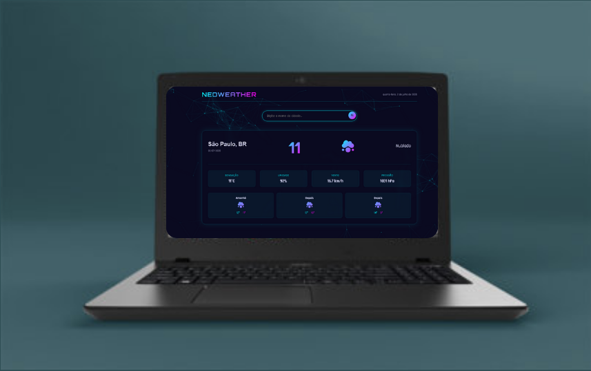

# 🌤️ NeoWeather

**NeoWeather** é um site de previsão do tempo desenvolvido por mim com foco em **experiência do usuário (UX)**, **interface furista e intuitiva (UI)** e design responsivo. O projeto foi criado 100% do zero — desde a **identidade visual**, **layout**, até a **estrutura de código em HTML, CSS e JavaScript puro**.

  

  

  <i>Visual do projeto “NeoWeather” — site responsivo, leve e intuitivo para quem quer acompanhar o clima em tempo real. ☀️🌧️🌙</i>

 

---

## 🚀 Tecnologias Utilizadas

- 🔹 **HTML5** — estrutura semântica e organizada  
- 🔹 **CSS3** — responsividade e design moderno  
- 🔹 **JavaScript (ES6+)** — requisições à API e interatividade  
- 🔹 **API OpenWeatherMap** — dados reais de previsão do tempo  
- 🔹 **Design UX/UI** — foco na navegação simples e visual agradável  

 

---

## 🧠 Sobre o Projeto

O **NeoWeather** tem como objetivo permitir que o usuário consulte a previsão do tempo de forma rápida, prática e visualmente agradável. Entre os principais pontos:

- 🌍 Busca de clima por cidade, com dados atualizados  
- 🌡️ Exibição clara da temperatura, umidade e vento  
- 🌦️ Ícones dinâmicos que ilustram as condições climáticas  
- 📱 Layout adaptado para todos os dispositivos, do celular ao desktop  
- ⚙️ Código limpo e organizado, fácil de entender e modificar  

 

---

## 📁 Estrutura do Projeto

<pre>
NeoWeather/
│
├── assets/
│       └── mockup/
│
├── css/
│   └── style.css
│
├── js/
│   ├── main.js
│
├── index.html
└── README.md
</pre>

 

---

## 📱 Responsividade

O site é totalmente responsivo, garantindo uma ótima experiência em dispositivos móveis, tablets e desktops.

 

---

## 🛠️ Autor

Desenvolvido por **Lucas Silva** 💻

- Portifolio [Ver Portifolio](https://portif-lio-nu-two.vercel.app/)  
- GitHub: [Ver Perfil](https://github.com/Lucas-tech-silva)  
- LinkedIn: [Ver LinkedIn](https://www.linkedin.com/in/lucassilva-developer/)

 

---

## 📌 Status do Projeto

✅ Concluído | 💡 Futuras melhorias: modo escuro, previsão estendida, gráficos de temperatura e umidade, painel de favoritos.

 

---

## 🎉 Fun Fact

  ☀️ *Sabia que a previsão do tempo existe desde o século XIX, mas só com a internet e APIs ficou fácil para todo mundo acessar?*  

 

  

 
