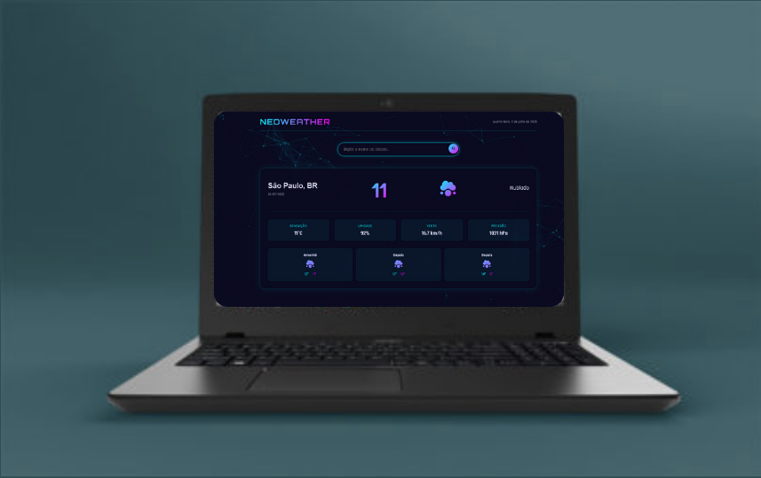

# 🌤️ NeoWeather

<p align="center">


</p>

> Aplicação Full Stack para consulta de previsão do tempo em tempo real, com foco em **performance, UX/UI e segurança de API**.

<br>

<p align="center">
  
</p>

<p align="center">
  <i>Interface moderna, responsiva e intuitiva para visualização de dados climáticos em tempo real.</i>
</p>

<br>

---

## 🚀 Visão Geral

O **NeoWeather** é uma aplicação full stack desenvolvida do zero para fornecer dados climáticos em tempo real de forma rápida, intuitiva e visualmente agradável.

O projeto também implementa uma arquitetura segura, garantindo que a **API Key não seja exposta no frontend**, seguindo boas práticas utilizadas em aplicações profissionais.

---

## ✨ Principais Funcionalidades

* 🔐 Proteção da API Key com backend intermediário (Node.js)
* ⚡ Consultas rápidas e otimizadas de dados climáticos
* 🎨 Interface moderna com foco em experiência do usuário (UX/UI)
* 📱 Layout totalmente responsivo (mobile-first)
* 🌐 Integração com API real de clima (OpenWeatherMap)
* 🧱 Estrutura organizada e escalável

---

## 🧠 Desafios que resolvi

* 🔥 Integração entre frontend e backend sem expor a API Key
* 🌐 Deploy do backend no Render e frontend na Vercel
* ⚙️ Configuração de CORS para comunicação entre domínios diferentes
* ❌ Tratamento de erro para cidades inválidas na API
* 📡 Consumo e normalização de dados da OpenWeatherMap
* 🚀 Deploy e configuração de variáveis de ambiente (.env)
* 🧩 Correção de problemas de “Failed to fetch” em produção

---

## 🛠️ Tecnologias Utilizadas

### 🎨 Frontend
- HTML5 (estrutura semântica)
- CSS3 (estilização responsiva)
- JavaScript ES6+ (interatividade e consumo de API)

### ⚙️ Backend
- Node.js (runtime JavaScript)
- Express (criação de API e rotas)
- dotenv (gerenciamento de variáveis de ambiente)
- CORS (controle de acesso entre aplicações)

### 🌐 API
- OpenWeatherMap API (dados climáticos em tempo real)

---

## 🔐 Arquitetura da Aplicação

Para garantir segurança e boas práticas, a aplicação utiliza um backend intermediário para proteger credenciais sensíveis.

### Fluxo de dados:

```text
Frontend → Backend → OpenWeather API
```

* O frontend envia a requisição
* O backend processa e consome a API
* A chave da API permanece protegida no servidor

📌 Essa abordagem segue boas práticas utilizadas em aplicações reais.

---

## 📁 Estrutura do Projeto

```text
NeoWeather/
│
├── frontend/
│   ├── assets/
│   ├── css/
│   ├── js/
│   └── index.html
│
├── backend/
│   ├── server.js
│   ├── package.json
│   └── .env
│
└── README.md
```

---

## ▶️ Como Executar Localmente

### 🔹 Backend

```bash
cd backend
npm install
node server.js
```

Servidor local:

👉 http://localhost:3000

## 🌐 Aplicação em Produção

O projeto já está disponível online:

👉 https://neo-weather-alpha.vercel.app/

---

### 🔹 Frontend

Abra:

```
frontend/index.html
```

ou utilize o Live Server no VS Code.

---

## 📱 Responsividade

Aplicação adaptada para:

* 📱 Smartphones
* 📲 Tablets
* 💻 Desktops

---

## 📊 Melhorias Futuras

* 🌙 Modo escuro
* 📈 Gráficos de temperatura
* 📅 Previsão estendida
* ⚡ Histórico de cidades pesquisadas
* 📍 Geolocalização automática

---

## 👨‍💻 Autor

**Lucas Silva**

* 🌐 Portfólio: https://portif-lio-nu-two.vercel.app/
* 💻 GitHub: https://github.com/Lucas-tech-silva
* 🔗 LinkedIn: https://www.linkedin.com/in/lucassilva-developer/

---

## 📌 Status

✅ Projeto concluído e funcional
🚀 Em constante evolução

---

## 💡 Insight

<p align="center">
<p align="center"> <i> “Um projeto se torna profissional quando une arquitetura, performance e boas práticas reais de mercado.” </i> </p>
