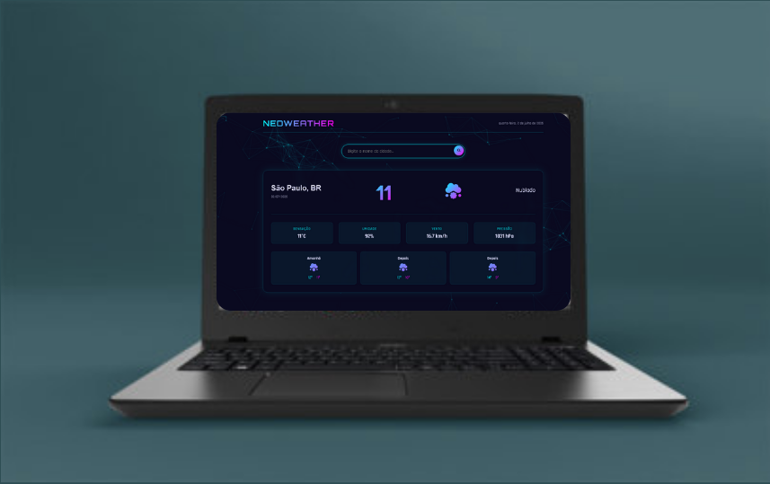

  # 🌤️ NeoWeather

> Aplicação web para consulta de dados climáticos em tempo real, com foco em **performance, integração de APIs e responsividade**.

<br>

<div align="center">


</div>

<br>

<p align="center">
  
</p>

<p align="center">
  <i>Interface moderna, responsiva e intuitiva para visualização de dados climáticos em tempo real.</i>
</p>

<br>

---

## 🚀 Visão Geral

O **NeoWeather** é uma aplicação web desenvolvida do zero para fornecer dados climáticos em tempo real de forma rápida, intuitiva e visualmente agradável.

O projeto utiliza uma arquitetura com **frontend separado da camada de API**, mantendo a chave da OpenWeather protegida no ambiente do **Cloudflare Workers**, sem expô-la diretamente no código do frontend.

A aplicação consome dados da **OpenWeather API** através de uma API intermediária hospedada no Cloudflare Workers.

<br>

---

## ✨ Principais Funcionalidades

- 🔐 Proteção da API Key através do Cloudflare Workers
- ⚡ Consultas rápidas de dados climáticos
- 🌐 Integração com a OpenWeather API
- 🎨 Interface moderna com foco em experiência do usuário (UX/UI)
- 📱 Layout totalmente responsivo
- 🔎 Pesquisa de cidades em tempo real
- ❌ Tratamento de erros para cidades inválidas
- 🌤️ Exibição de informações climáticas atuais
- 📊 Exibição de temperatura, sensação térmica, umidade, vento e pressão
- 🧱 Estrutura organizada e separação entre frontend e API

<br>

---

## 🧠 Desafios que resolvi

- 🔥 Integração entre frontend e uma API intermediária sem expor a API Key
- ☁️ Migração da API de um servidor Node.js/Express para Cloudflare Workers
- ⚙️ Configuração de CORS para comunicação entre frontend e API
- 🌐 Integração com a OpenWeather API
- ❌ Tratamento de erros para cidades inexistentes
- 🔒 Gerenciamento seguro da variável `OPENWEATHER_API_KEY`
- 🧩 Correção de problemas de comunicação entre frontend e API em produção
- 🚀 Deploy do frontend e da API em serviços independentes
- 🧪 Implementação de testes para a API
- 🛠️ Configuração do projeto utilizando Wrangler

<br>

---

## 🛠️ Tecnologias Utilizadas

### 🎨 Frontend

- HTML5 — estrutura semântica
- CSS3 — estilização e responsividade
- JavaScript ES6+ — lógica, interatividade e consumo da API
- Particles.js — efeitos visuais
- Font Awesome — ícones

### ⚙️ API / Backend

- Cloudflare Workers — execução da API intermediária

- JavaScript — desenvolvimento da lógica da API

- Wrangler — desenvolvimento, configuração e deploy do Worker

- Vitest — testes automatizados

### 🌐 API Externa

- OpenWeather API — fornecimento dos dados climáticos em tempo real

<br>

---

## 🔐 Arquitetura da Aplicação

Para proteger as credenciais da OpenWeather API, o projeto utiliza o **Cloudflare Workers como camada intermediária entre o frontend e a API externa**.

### Fluxo de dados:

```text
Frontend
   ↓
Cloudflare Workers
   ↓
OpenWeather API
```

📌 A chave da OpenWeather API permanece protegida no ambiente do Cloudflare Workers e não é exposta diretamente no código do frontend.

<br>

---

## 📁 Estrutura do Projeto

```text
NeoWeather/
│
├── frontend/
│   ├── assets/
│   │   ├── CV/
│   │   └── mockup/
│   │
│   ├── css/
│   │   └── style.css
│   │
│   ├── js/
│   │   └── script.js
│   │
│   └── index.html
│
├── neoweather-api/
│   ├── src/
│   │   └── index.js
│   │
│   ├── test/
│   │   └── index.spec.js
│   │
│   ├── .editorconfig
│   ├── .gitignore
│   ├── .prettierrc
│   ├── package-lock.json
│   ├── package.json
│   ├── vitest.config.mjs
│   └── wrangler.jsonc
│
└── README.md
```

---

<br>

## ▶️ Como Executar Localmente

### 🔹 API

Entre na pasta da API:

```bash
cd neoweather-api

npx wrangler dev
```

<br>

## 🌐 Aplicação em Produção

O projeto já está disponível online:

👉 https://neo-weather-iota.vercel.app/

<br>

---

### 🔹 Frontend

Abra:

```
frontend/index.html
```

ou utilize o Live Server no VS Code.

<br>

---

## 📱 Responsividade

Aplicação adaptada para:

- 📱 Smartphones
- 📲 Tablets
- 💻 Desktops

<br>

---

## 📊 Melhorias Futuras

- 📈 Gráficos de temperatura
- 📅 Previsão estendida
- ⚡ Histórico de cidades pesquisadas
- 📍 Geolocalização automática

=======

<br>

---

## 👨‍💻 Autor

**Lucas Silva**

- 🌐 Portfólio: https://lucas-portfolio-flax.vercel.app/
- 💻 GitHub: https://github.com/Lucas-tech-silva
- 🔗 LinkedIn: https://www.linkedin.com/in/lucassilva-developer/
- 📧 Email: [lucassilva1710@yahoo.com](mailto:lucassilva1710@yahoo.com?subject=Oportunidade&body=Olá%20Lucas,%0A%0AVi%20o%20projeto%20NeoWeather%20e%20gostaria%20de%20falar%20sobre%20uma%20oportunidade.%0A)

<br>

---

## 📌 Status

✅ Projeto concluído e funcional

🚀 Em constante evolução

<br>

---

## 💡 Insight

<p align="center"> “Um projeto se torna profissional quando une arquitetura, performance e boas práticas reais de mercado.” </p>
